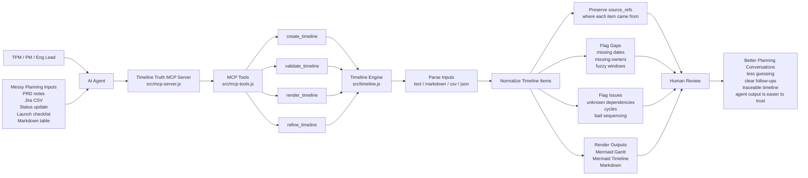

# Timeline Truth

Status: v0.1.0 public release. MIT licensed. Requires Node.js 22 or newer.

Timeline Truth is a local MCP server for AI-agent TPM workflows: paste PRD/Jira/status notes,
CSV exports, launch checklists, or rough planning text; get timeline JSON,
validation gaps, assumptions, and Mermaid/Markdown renders.

It is intentionally narrow. Timeline Truth does not invent missing dates,
owners, or dependencies. It preserves `source_refs` and makes planning
uncertainty visible so humans can review the timeline instead of trusting a
confident rewrite.

## First Use

### Easy Way: Ask Your Agent

Tell your AI agent:

```text
let's use timeline-truth from https://github.com/hilmimuktitama/timeline-truth
```

The GitHub repo is the discovery source. After reading this README, your agent
should install the stable npm package, add the MCP server to your local agent
config, reload MCP if needed, and verify `create_timeline` is available.

Your agent should handle the setup for you. Most users should not copy MCP JSON
by hand. The agent-facing install checklist is in
[docs/AI-AGENT-INSTALL.md](docs/AI-AGENT-INSTALL.md).

Manual fallback/reference config:

Use this only if your agent cannot edit MCP config automatically. In that case,
ask the agent to tell you exactly where this JSON belongs in your current
MCP-capable client.

```json
{
  "mcpServers": {
    "timeline-truth": {
      "command": "npx",
      "args": ["-y", "--package=timeline-truth", "timeline-truth-mcp"]
    }
  }
}
```

After setup, paste your planning notes and ask your agent:

```text
Use the timeline-truth MCP server. Call create_timeline with these notes as a
single source. Then summarize the timeline, list gaps and assumptions, and show
the mermaid_gantt output. Do not infer missing dates, owners, or dependencies;
use the tool gaps as follow-up questions.
```

The expected result is that your agent calls `create_timeline` for you and
returns normalized timeline items, explicit gaps, assumptions, and portable
Mermaid output. You do not need to manually run the MCP tool.

Use it when your planning input looks like this:

```text
Discovery: 2026-06-01 to 2026-06-05 owner PM status planned
API contract: starts 2026-06-06 duration 4d owner Platform depends on Discovery
Checkout QA: owner QA depends on API contract
Launch decision milestone on 2026-06-17 owner PM
```

The server returns normalized items, gaps such as missing start/end dates, the
default assumption that dates were not inferred, and portable Mermaid output.

For larger Markdown notes, `create_timeline` can parse only selected headings
and ignore the rest:

```json
{
  "sources": [
    {
      "id": "program-note",
      "type": "markdown",
      "path": "docs/program.md",
      "content": "..."
    }
  ],
  "markdown": {
    "sections": ["Timeline", "Follow-Ups"],
    "ignoreFrontmatter": true
  }
}
```

Markdown tables under those headings are parsed into items. Fuzzy targets such
as `W3-W4 May 2026` are preserved as `time_window`/`date_text` and flagged with
an `exact_date` gap instead of being converted into invented dates. The response
also includes `noise_report.ignored` counts for skipped frontmatter, prose, and
table rows without target dates.

## Why This Exists

Most timeline tools assume the plan is already structured. Real planning inputs
usually are not. They are PRD snippets, Jira notes, launch checklists, weekly
status updates, CSV exports, and Slack summaries.

Timeline Truth focuses on the handoff from messy planning material to a
reviewable timeline:

- preserve `source_refs` so every item can point back to evidence
- flag missing dates, owners, and dependency problems instead of guessing
- render portable Mermaid and Markdown artifacts
- stay small enough to run inside local agent workflows

## How It Works

Timeline Truth gives AI agents a deterministic timeline compiler and validator,
so messy planning notes become traceable, reviewable timeline artifacts instead
of confident guesses.



This helps users move from scattered planning evidence to a timeline that can be
checked, challenged, refined, and shared.

## Why not just ask ChatGPT or Mermaid?

ChatGPT can draft a timeline, and Mermaid can render one. Timeline Truth does a
smaller job: it gives the agent a deterministic compiler/validator so the output
keeps evidence, gaps, assumptions, and repeatable render formats.

That matters when a TPM, PM, or engineering lead needs to review what is known,
what is missing, and where each timeline item came from.

## Install

Local checkout:

```bash
npm install
node src/mcp-server.js
```

Npm package config:

```json
{
  "mcpServers": {
    "timeline-truth": {
      "command": "npx",
      "args": ["-y", "--package=timeline-truth", "timeline-truth-mcp"]
    }
  }
}
```

Optional global install:

```bash
npm install -g timeline-truth
timeline-truth-mcp
```

If your global npm bin directory is on `PATH`, you can also configure the MCP
server with `"command": "timeline-truth-mcp"`. The `npx --package` config above
is the most portable option because it does not depend on global shell setup.

For local development, use the checkout config in
[docs/MCP-SETUP.md](docs/MCP-SETUP.md).

## MCP Tools

- `create_timeline`: compile source content into timeline JSON plus Mermaid
  outputs.
- `validate_timeline`: report missing dates, owners, unknown dependencies,
  circular dependencies, and impossible sequencing.
- `render_timeline`: render a normalized timeline as `mermaid_gantt`,
  `mermaid_timeline`, or `markdown`.
- `refine_timeline`: apply edits while preserving evidence (`source_refs`) and
  assumptions.

## Examples

Realistic fixtures live in [examples](examples):

- [PRD snippet](examples/prd-snippet.md)
- [Jira CSV export](examples/jira-export.csv)
- [Launch checklist](examples/launch-checklist.md)
- [Status update](examples/status-update.md)

Each example has a compact expected-output JSON file and is covered by tests.

## Current limitations

- Text parsing is heuristic. It works best when each planning item is on its own
  line.
- Markdown parsing supports heading filters and simple pipe tables, but rich
  nested documents are not fully parsed.
- CSV and JSON are more reliable than free-form notes when exact fields matter.
- There are no Jira, Confluence, Slack, or hosted imports in this release.
- The server validates dependencies by item title, not by external issue keys.

## Project Boundaries

Timeline Truth is not a project management system, scheduling optimizer, or
visual planning app. It is a compiler and validator for timeline artifacts.

Good fits:

- turning rough planning notes into a reviewable timeline
- finding missing dates, owners, and dependency issues
- generating Mermaid timelines for docs and status reports
- preserving evidence during AI-assisted planning

Poor fits:

- capacity planning
- drag-and-drop timeline editing
- automatic schedule generation from vague goals
- replacing Jira, Asana, Smartsheet, or similar systems of record

## Development

```bash
npm install
npm test
npm run check
npm pack --dry-run
```

See [docs/RELEASE.md](docs/RELEASE.md) before publishing.

## Contributing

Contributions are welcome when they keep the project narrow and evidence-first.
Before adding features, check [CONTRIBUTING.md](CONTRIBUTING.md).

## License

MIT
