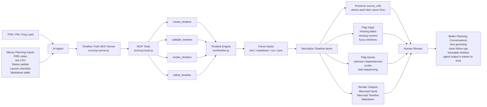

# Timeline Truth

Status: v0.3.1 prepared source (not yet published). MIT licensed. Requires Node.js 22 or newer.

Releases are published from an exact, version-checked release tag after the
trusted workflow passes its tests, audit, contracts, evaluation, CLI diff, and
package gates. See [docs/RELEASE.md](docs/RELEASE.md) for the release sequence.

Timeline Truth is a local MCP server and CLI for AI-agent TPM workflows: paste PRD/Jira/status notes,
CSV exports, launch checklists, or rough planning text; get timeline JSON,
evidence grades, validation gaps and issues, assumptions, Mermaid/Markdown
renders, and schedule diffs.

[`truth-tools`](https://github.com/hilmimuktitama/truth-tools) is the deterministic status-artifact review gate for the Truth Suite. Timeline Truth remains independently usable as the focused tool for parsing, validation, rendering, refinement, and schedule drift; use it directly when you need those timeline capabilities.

It is intentionally narrow. Timeline Truth does not invent missing dates,
owners, or dependencies. It preserves `source_refs`, grades every item by the
evidence actually available, and makes planning uncertainty visible so humans
can review the timeline instead of trusting a confident rewrite.

## First Use

### Easy Way: Ask Your Agent

Tell your AI agent:

```text
let's use timeline-truth from https://github.com/hilmimuktitama/timeline-truth
```

The GitHub repo is the discovery source. After reading this README, your agent
should install the stable npm package, add the MCP server to your local agent
config, reload MCP if needed, and verify `create_timeline` is available.

Your agent should handle the setup for you. Most users should not copy MCP JSON
by hand. The agent-facing install checklist is in
[docs/AI-AGENT-INSTALL.md](docs/AI-AGENT-INSTALL.md).

Manual fallback/reference config:

Use this only if your agent cannot edit MCP config automatically. In that case,
ask the agent to tell you exactly where this JSON belongs in your current
MCP-capable client.

```json
{
  "mcpServers": {
    "timeline-truth": {
      "command": "npx",
      "args": ["-y", "--package=timeline-truth", "timeline-truth-mcp"]
    }
  }
}
```

After setup, paste your planning notes and ask your agent:

```text
Use the timeline-truth MCP server. Call create_timeline with these notes as a
single source. Then summarize the timeline, list gaps and assumptions, and show
the mermaid_gantt output. Do not infer missing dates, owners, or dependencies;
use the tool gaps as follow-up questions.
```

The expected result is that your agent calls `create_timeline` for you and
returns normalized timeline items, explicit gaps, assumptions, and portable
Mermaid output. You do not need to manually run the MCP tool.

Use it when your planning input looks like this:

```text
Discovery: 2026-06-01 to 2026-06-05 owner PM status planned
API contract: starts 2026-06-06 duration 4d owner Platform depends on Discovery
Checkout QA: owner QA depends on API contract
Launch decision milestone on June 17, 2026 owner PM
```

Ask your agent:

```text
Use the timeline-truth MCP server. Call create_timeline with these notes as a
single source. Then summarize the timeline, list gaps and assumptions, and show
the mermaid_gantt output. Do not infer missing dates or owners.
```

The server returns normalized items with deterministic `evidence_grade`
values, grouped follow-up questions, gaps such as missing start/end dates, the
default assumptions that dates were not inferred and that the critical path is
not computed, and portable Mermaid output.

For a quick local smoke test without configuring an MCP client, run the CLI:

```bash
timeline-truth examples/launch-checklist.md --format review
```

The CLI reads from stdin when no file is provided, and can print `json`,
`markdown`, `mermaid_gantt`, `mermaid_timeline`, or `review` output.

Compare two timeline JSON files (for example a baseline plan and the current
plan) with the schedule diff:

```bash
timeline-truth diff examples/baseline-plan.json examples/current-plan.json --format markdown
timeline-truth diff examples/baseline-plan.json examples/current-plan.json --format json
```

The diff reports scope additions/removals, start/end/duration/range movements,
owner, dependency, status, and evidence-grade changes, plus new impossible
sequencing. It never computes a critical path: with incomplete data a critical
path cannot be determined defensibly.

For larger Markdown notes, `create_timeline` can parse only selected headings
and ignore the rest:

```json
{
  "sources": [
    {
      "id": "program-note",
      "type": "markdown",
      "path": "docs/program.md",
      "content": "..."
    }
  ],
  "markdown": {
    "sections": ["Timeline", "Follow-Ups"],
    "ignoreFrontmatter": true
  }
}
```

Markdown tables under those headings are parsed into items. Fuzzy targets such
as `W3-W4 May 2026` are preserved as `time_window`/`date_text` and flagged with
an `exact_date` gap instead of being converted into invented dates. The response
also includes `noise_report.ignored` counts for skipped frontmatter, prose,
metadata lines, unsupported tables, and table rows without target dates.
`source_refs` on every item always point back to the original content —
original line numbers, table row numbers, and raw row text are kept even when
table headers are normalized or profiled note tables are transformed. Each
reference uses the canonical SourceRef contract: a required `source_id`
(identifying the source record in the same artifact) and a required
deterministic `locator` — the source path (or stable source id) with the line,
table row, or heading appended. The legacy `sourceId` field and plain-string
references are still accepted on input, converted to `source_id` + `locator`,
and reported as deprecation warnings in `noise_report.warnings`.

## Evidence Grades

Every timeline item carries `evidence_grade`, replacing the old arbitrary
numeric `confidence`. The grade is computed by documented, deterministic rules
and can never be overridden by caller input:

| Grade | Rule |
| --- | --- |
| `exact` | At least one explicit `YYYY-MM-DD` date (or a timezone-bearing datetime, reduced to its date) is present. |
| `derived` | No explicit date, but a natural-language date such as `June 17, 2026` was converted deterministically. |
| `fuzzy` | No exact or derived date; only a fuzzy time window (`time_window`) was preserved for human review. |
| `missing` | No date evidence at all; timeline placement needs human follow-up. |

Each grade comes with a fixed `evidence_reason` string. Grades never guess:
there is no numeric interpolation between "exact" and "missing".

Items also carry `date_derivation` (`explicit` / `natural` / `none`), which
records how the date evidence was obtained before normalization rewrote it.
Because derivation survives re-normalization, a `derived` item keeps its grade
even after its natural date was converted to `YYYY-MM-DD`.

## Why This Exists

Most timeline tools assume the plan is already structured. Real planning inputs
usually are not. They are PRD snippets, Jira notes, launch checklists, weekly
status updates, CSV exports, and Slack summaries.

Timeline Truth focuses on the handoff from messy planning material to a
reviewable timeline:

- preserve `source_refs` so every item can point back to evidence
- grade evidence with `exact`/`derived`/`fuzzy`/`missing` instead of guessing
- flag missing dates, owners, and dependency problems instead of guessing
- validate strictly: real calendar dates, malformed durations, duplicate ids,
  duplicate dependencies, timezone-free datetimes, and unsafe fields
- diff baseline vs current plans so schedule drift is explicit
- render portable Mermaid and Markdown artifacts
- stay small enough to run inside local agent workflows

## How It Works

Timeline Truth gives AI agents a deterministic timeline compiler and validator,
so messy planning notes become traceable, reviewable timeline artifacts instead
of confident guesses.



This helps users move from scattered planning evidence to a timeline that can be
checked, challenged, refined, and shared.

## Why not just ask ChatGPT or Mermaid?

ChatGPT can draft a timeline, and Mermaid can render one. Timeline Truth does a
smaller job: it gives the agent a deterministic compiler/validator so the output
keeps evidence, gaps, assumptions, and repeatable render formats.

That matters when a TPM, PM, or engineering lead needs to review what is known,
what is missing, and where each timeline item came from.

## Install

Local checkout:

```bash
npm ci
node src/mcp-server.js
```

Npm package config:

```json
{
  "mcpServers": {
    "timeline-truth": {
      "command": "npx",
      "args": ["-y", "--package=timeline-truth", "timeline-truth-mcp"]
    }
  }
}
```

Optional global install:

```bash
npm install -g timeline-truth
timeline-truth examples/launch-checklist.md --format review
timeline-truth diff examples/baseline-plan.json examples/current-plan.json
timeline-truth-mcp
```

If your global npm bin directory is on `PATH`, you can also configure the MCP
server with `"command": "timeline-truth-mcp"`. The `npx --package` config above
is the most portable option because it does not depend on global shell setup.

For local development, use the checkout config in
[docs/MCP-SETUP.md](docs/MCP-SETUP.md).

## MCP Tools

- `create_timeline`: compile source content into timeline JSON plus Mermaid
  outputs.
- `validate_timeline`: report missing dates, owners, unknown dependencies,
  circular dependencies, impossible sequencing, invalid calendar dates,
  timezone-free datetimes, malformed durations, duplicate ids/dependencies,
  missing titles, and unsupported dangerous fields.
- `render_timeline`: render a normalized timeline as `mermaid_gantt`,
  `mermaid_timeline`, `markdown`, or `review_report`.
- `refine_timeline`: apply edits while preserving evidence (`source_refs`) and
  assumptions. Every update requires `matchTitle` or `matchId`; setting exact
  dates clears stale fuzzy state (`time_window`, `date_text`,
  `exact_date_needed`) and vice versa, and the evidence grade is always
  recomputed from the edited evidence.
- `diff_timelines`: compare baseline vs current timelines and report all
  change categories. Ambiguous duplicate matches (several current items
  matching one baseline item) are reported, never silently guessed. Critical
  path is never computed.

## Validation Rules

Strict validations are deterministic and advisory to humans (nothing is
silently "fixed"):

- Gaps (follow-up questions): missing start, missing end (non-milestones),
  missing owner (one per item), fuzzy window needing an exact date.
- Issues: unknown dependencies (with title suggestions), circular dependencies,
  impossible sequences (item starts before a dependency ends), `start_after_end`,
  invalid calendar dates (`2026-02-30` fails; `2024-02-29` passes),
  timezone-free datetimes (a datetime with a time-of-day but no timezone is
  rejected for scheduling; timezone-bearing datetimes are accepted and reduced
  to their date), malformed durations, duplicate dependencies, duplicate ids,
  missing titles, and unsupported dangerous fields (`__proto__`, `constructor`,
  `prototype`, `eval`, `exec`, `command`, `shell`, `script`, `spawn`,
  `require`, `import`, `fetch`, `child_process`, `os` — dropped and flagged).

## Schemas And Drift Verification

The normalized contracts are published as JSON Schema files (Draft 2020-12):

- [schemas/timeline-item.schema.json](schemas/timeline-item.schema.json)
- [schemas/source-ref.schema.json](schemas/source-ref.schema.json)

`npm run contracts:verify` always validates the local schemas structurally and
checks real engine output against them — including the canonical SourceRef
contract, where every `source_refs` entry carries the required `source_id` and
deterministic `locator`. When
`../truth-tools/packages/contracts/schemas/` exists beside this checkout, the
verifier also performs a byte-exact comparison automatically. To require that
comparison explicitly, set `TRUTH_TOOLS_SCHEMA_DIR` to the contracts schema
directory (relative paths are resolved from this repository's root); missing
paths/files or any byte difference then fail the run. The verifier also fails
if its own local schema bytes cannot be read during a comparison. Without
either source, it clearly reports that cross-repository bytes were skipped; it
never presents that as a successful cross-repository check. Truth Tools owns
the deterministic status-artifact review gate and can perform the portfolio-level
 cross-repository check. This standalone Timeline Truth check has no runtime
 dependency on Truth Tools and avoids a circular merge dependency.

## Examples

Realistic fixtures live in [examples](examples):

- [PRD snippet](examples/prd-snippet.md)
- [Jira CSV export](examples/jira-export.csv)
- [Launch checklist](examples/launch-checklist.md)
- [Status update](examples/status-update.md)
- [Baseline plan](examples/baseline-plan.json) vs [current plan](examples/current-plan.json)
  with the expected [drift JSON](examples/timeline-drift.json) and
  [drift Markdown](examples/timeline-drift.md)

Each example has a compact expected-output JSON file and is covered by tests.

## Evaluation

`npm run eval` runs the synthetic regression/evaluation suite in
[evaluation](evaluation): deterministic cases plus the example fixtures,
checked for titles, gaps, issue types, evidence grades, and renders. This is a
regression net, not an accuracy benchmark — see
[evaluation/README.md](evaluation/README.md) for honest limitations.

## Current limitations

- Text parsing is heuristic. It works best when each planning item is on its own
  line.
- Markdown parsing supports heading filters, frontmatter/metadata skipping,
  simple pipe tables, and profiled note tables (`estimate_table`,
  `objective_table`, `progress_table`), but rich nested documents are not fully
  parsed.
- CSV and JSON are more reliable than free-form notes when exact fields matter.
- There are no Jira, Confluence, Slack, or hosted imports in this release.
- The server validates dependencies by item title, not by external issue keys.
- A critical path is never computed: it cannot be determined defensibly with
  incomplete data.

## Project Boundaries

Timeline Truth is not a project management system, scheduling optimizer, or
visual planning app. It is a compiler and validator for timeline artifacts.

Good fits:

- turning rough planning notes into a reviewable timeline
- finding missing dates, owners, and dependency issues
- detecting schedule drift between a baseline plan and the current plan
- generating Mermaid timelines for docs and status reports
- preserving evidence during AI-assisted planning

Poor fits:

- capacity planning
- drag-and-drop timeline editing
- automatic schedule generation from vague goals
- computing a defensible critical path from incomplete planning data
- replacing Jira, Asana, Smartsheet, or similar systems of record

## Development

```bash
npm ci
npm test
npm run check
npm run contracts:verify
npm run eval
npm pack --dry-run
```

Or run the whole verification chain with `npm run verify`. See
[docs/RELEASE.md](docs/RELEASE.md) before publishing and
[MIGRATION.md](MIGRATION.md) when upgrading from 0.2.x.

## License

MIT
